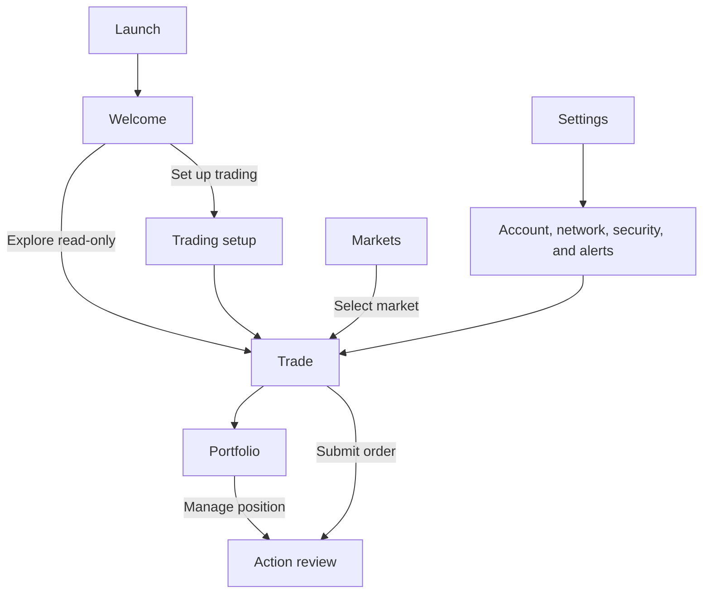

# Mobile Screen System

## Product intent

Hyper Trader is a mobile-native Hyperliquid trading client for iOS and Android.
The screen system must make market discovery, order execution, and portfolio control feel continuous while preserving explicit account, network, and signing boundaries.

The primary user is assumed to be an active or prospective Hyperliquid trader who wants a native mobile experience.
This audience definition is a product assumption because independent demand evidence has not yet been supplied.

## Experience principles

- **Fast trading loop.** A returning user can reopen the last market, configure an order, and reach review without leaving Trade.
- **Fluid exploration.** Markets, charts, order books, and filters preserve useful context and render cached data before refreshing.
- **Immediate account control.** Portfolio performance and position actions remain easy to reach without weakening confirmation requirements.
- **Progressive density.** Essential controls remain visible while advanced controls appear only when applicable.
- **Explicit trading context.** The active master account, network, market, and signing-session state are visible wherever they affect an action.
- **Safe state transitions.** Changing the account, network, market, or market metadata invalidates any order draft that can no longer be trusted.

## Navigation model

The authenticated and read-only experiences share four bottom tabs:

1. **Markets** — discovery, favorites, recents, search, filters, and market selection.
2. **Trade** — the default landing tab and the complete market-inspection and order-entry surface.
3. **Portfolio** — performance, positions, orders, balances, fills, and funding activity.
4. **Settings** — accounts, API wallets, security, notifications, trading preferences, privacy, and support.

The active account and network are global context rather than tab-local settings.
Users can switch accounts from the Markets, Trade, and Portfolio headers; Settings owns full account management.

## Key product decisions

- **Hybrid onboarding.** Users may set up trading during onboarding or skip directly into read-only exploration. Governs R13–R19.
- **Session authentication.** Device authentication unlocks a short-lived trading session; every state-changing action still receives an explicit review. Governs R18, R26, R32, R38.
- **Trade-first home.** Trade reopens the last-used market and provides a searchable market switcher. Governs R1, R20.
- **Inline progressive order entry.** The order panel stays on Trade, with essential controls visible and advanced controls revealed contextually. Governs R21–R25.
- **Performance-first portfolio.** Portfolio leads with account value and PnL before exposing positions, orders, balances, and history. Governs R29–R32.
- **Unified account view.** Spot and perpetual activity share one portfolio overview with filters rather than separate account experiences. Governs R30, R33.
- **Global multi-account support.** Multiple master accounts are supported, with isolated API-wallet credentials, nonce state, preferences, and cached data. Governs R2, R3, R33, R36–R39.
- **Configurable native alerts.** Push notifications cover execution, risk, price, and funding events while keeping all signing authority on-device. Governs R42–R46.

## Requirements

### Shared application behavior

- R1. The app must expose Markets, Trade, Portfolio, and Settings as persistent bottom-level destinations, with Trade selected by default after entering the tab shell.
- R2. The active account and network must remain visible on Trade, Portfolio, action review, and every signed-action result.
- R3. Switching account or network must clear incompatible cached private data, lock the prior signing session, and invalidate stale action drafts.
- R4. Read-only users must be able to browse every validated market without connecting a wallet.
- R5. Loading, stale, offline, empty, unavailable, and retry states must preserve the last trustworthy data whenever it remains safe to display.
- R6. Primary controls must meet native accessibility expectations for labels, focus order, touch targets, text scaling, reduced motion, and non-color status cues.

### Market coverage and discovery

- R7. The market catalog must come from current validated Hyperliquid metadata rather than a hard-coded symbol list.
- R8. The catalog must cover native perpetuals, builder-deployed HIP-3 perpetuals, and spot pairs returned by the supported metadata endpoints.
- R9. Markets must preserve their asset identifiers, venue, precision, margin mode, leverage limits, lifecycle state, and display names as separate validated attributes.
- R10. Markets that are delisted, unavailable, or fail validation must not expose an enabled order action.
- R11. Markets must support favorites, recent history, search, and filters for type, price change, volume, funding, and open interest when those metrics apply.
- R12. Selecting a market from Markets or the Trade switcher must open it in Trade without changing the active account or network.

### Onboarding and trading setup

- R13. The welcome screen must offer **Set up trading** as the primary action and **Explore read-only** as the secondary action.
- R14. Read-only onboarding must end after the welcome choice and teach additional concepts only when the user reaches the relevant feature.
- R15. Trading setup must connect a master account, generate a dedicated API wallet, show its network and authority, obtain master-account approval, and confirm registration before enabling trading.
- R16. Hyper Trader must never request or persist a master-account seed phrase or private key.
- R17. Loss, expiry, or revocation of an API-wallet credential must be handled by rotation or reauthorization; secret material must never be displayed as a recovery mechanism.
- R18. Trading setup must offer device authentication and explain that it unlocks a temporary signing session rather than approving every future action.
- R19. A skipped or failed setup must remain resumable from Trade, Portfolio, and Settings without replaying the welcome experience.

### Trade

- R20. Trade must reopen the last valid market and show a complete searchable market switcher in its header.
- R21. Trade must combine market identity, core statistics, charting, order-book or trade data, account context, and the inline order panel within one screen surface.
- R22. The inline panel must keep side, order type, price when applicable, size, leverage when applicable, available balance or margin, and the primary review action visible.
- R23. Trigger settings, TP/SL, reduce-only, time-in-force, slippage, and other market-specific controls must appear only when applicable to the selected market and order type.
- R24. Order values must be validated against current network, market metadata, precision, price, size, leverage, margin, reduce-only, and slippage rules before review.
- R25. Review must show the account, network, market, side, order type, price or trigger, size, leverage or margin mode, reduce-only state, estimated fees, and relevant slippage before signing.
- R26. If the trading session expires during order entry or review, device authentication must restore the same still-valid draft before signing.
- R27. Submission must distinguish accepted, rejected, expired, and unresolved outcomes and reconcile each result with orders, fills, and positions.
- R28. The first complete production trading slice must support testnet market and limit orders, open-order display, fills, position updates, cancellation, and position closing.

### Portfolio

- R29. Portfolio must lead with total account value, absolute and percentage PnL, and a selectable time-range performance chart.
- R30. Portfolio must present one account overview with filters for positions, open orders, spot balances, fills, funding, and other supported activity.
- R31. Position rows must expose direct Close, TP/SL, and applicable margin actions without requiring a separate detail screen.
- R32. Direct portfolio actions must use the same validation, review, session-unlock, signing, result, and reconciliation rules as Trade.
- R33. Portfolio must isolate loading, cached data, and action state by master account, sub-account or vault context, and network.
- R34. Portfolio may display balances and deposit information but must not perform deposits, withdrawals, or internal transfers.
- R35. Any external funding handoff must identify the destination, active account, and network before leaving Hyper Trader.

### Settings and accounts

- R36. Settings must manage multiple master accounts and their separate API-wallet authorization, expiry, rotation, and revocation state.
- R37. The global account switcher must be accessible outside Settings while preventing switches during an in-flight signed action.
- R38. Security settings must expose trading-session state, device-authentication availability, timeout behavior, manual locking, and API-wallet revocation.
- R39. Network settings must keep public data, account data, API-wallet authorization, nonce state, alerts, and action history isolated between testnet and mainnet.
- R40. Trading preferences may provide safe defaults but must not suppress action review or silently bypass market-specific validation.
- R41. Settings must cover appearance, privacy, diagnostics, support, and legal or risk disclosures without mixing them into signing controls.

### Notifications

- R42. Users must be able to configure notifications for fills, cancellations, rejections, margin risk, liquidation risk, price targets, and funding events.
- R43. Notification rules must be scoped to the intended account, network, market, and event type.
- R44. Opening a notification must restore the matching account, network, and market context only after confirming the target context still exists.
- R45. The notification service may store public account identifiers, device push tokens, and alert rules but must never receive API-wallet keys, seed phrases, signed actions, or exchange authority.
- R46. Users must be able to revoke a device token, unlink an account, and remove its server-side alert data from Settings.

## Key flows

- F1. Read-only first launch
  - **Trigger:** A new user opens the app and chooses **Explore read-only**.
  - **Steps:** The app opens Trade with current public market data, keeps trading controls visibly locked, and offers contextual setup entry points.
  - **Outcome:** The user can explore Markets and Trade without creating an account credential.
  - **Covers:** R4, R13, R14, R19.

- F2. Trading setup
  - **Trigger:** A user chooses **Set up trading** from onboarding or a contextual prompt.
  - **Steps:** The user connects a master account, reviews the active network and requested agent authority, approves a newly generated API wallet externally, confirms registration, and enables device authentication.
  - **Outcome:** The account becomes trading-ready without exposing the master private key to Hyper Trader.
  - **Covers:** R15–R18, R36, R39.

- F3. Market-to-order flow
  - **Trigger:** A user selects a market from Markets or the Trade switcher.
  - **Steps:** Trade restores the market context, the user completes the inline order panel, local validation passes, review binds the action to account and network, and the API wallet signs after any required session unlock.
  - **Outcome:** The action reaches a clear submission state and reconciles into orders, fills, positions, and Portfolio.
  - **Covers:** R12, R20–R28.

- F4. Direct position management
  - **Trigger:** A user selects a quick action from a Portfolio position.
  - **Steps:** The app builds the position-scoped action, validates it against current account and market state, presents review, signs, submits, and reconciles the result.
  - **Outcome:** Urgent position control remains fast without bypassing safety boundaries.
  - **Covers:** R31–R33.

- F5. Global account switch
  - **Trigger:** A user selects another saved master account from a global header.
  - **Steps:** The app checks for in-flight actions, invalidates incompatible drafts, locks the prior signing session, swaps account-scoped data, and restores the destination account's last safe context.
  - **Outcome:** No private state, nonce state, order draft, or notification context leaks between accounts.
  - **Covers:** R2, R3, R33, R36–R39.

## Acceptance examples

- AE1. **Covers R3, R25.** Given an ETH order draft for account A on testnet, when the user switches to account B, then the draft is invalidated and cannot appear in B's review.
- AE2. **Covers R7–R10.** Given a newly listed validated HIP-3 market, when metadata refresh completes, then it appears in search without an app update and uses its returned constraints.
- AE3. **Covers R10, R24.** Given a delisted market or invalid precision metadata, when the user opens Trade, then market data may remain visible but order submission is disabled with a specific unavailable state.
- AE4. **Covers R19.** Given a user rejects master-wallet approval, when the user returns to Trade, then read-only exploration still works and setup can be resumed later.
- AE5. **Covers R26.** Given a valid order draft and an expired signing session, when device authentication succeeds, then the app revalidates and restores the draft before signing.
- AE6. **Covers R27.** Given submission times out after signing, when the exchange outcome is not yet known, then the app shows a reconciling state and does not invite an unsafe duplicate submission.
- AE7. **Covers R32.** Given a user taps Close from Portfolio, when review opens, then account, network, market, side, size, order behavior, and estimated impact remain visible before confirmation.
- AE8. **Covers R44.** Given a notification for account B arrives while account A is active, when the user opens it, then the app identifies the context switch before showing B's data.
- AE9. **Covers R45, R46.** Given a user unlinks an account from a device, when removal completes, then the device token and associated alert rules are revoked without affecting on-device signing credentials for other accounts.

## Success criteria

- A warm resume renders a usable cached Trade screen within one second on supported baseline devices.
- Tab and market switching show safe cached content without blocking on a fresh network request.
- A returning user with an unlocked session can configure an order and reach review without leaving Trade.
- Account and network changes never carry an incompatible order draft, private cache, signing session, or notification context forward.
- Every submitted action ends in an accepted, rejected, expired, or unresolved and reconciling state.
- New validated perpetual, HIP-3, and spot markets become discoverable without an application release.
- The first complete trading slice passes deterministic testnet workflow tests for market and limit orders, cancellation, fills, positions, and closing.

## Scope boundaries

- In-app deposits, withdrawals, and internal transfers are excluded.
- The master-account seed phrase and private key are never handled by Hyper Trader.
- Mainnet order submission remains disabled until API-wallet custody, signing, revocation, replay, nonce, and recovery designs pass a separate safety review.
- Read-only public market data may continue to use mainnet while authenticated development defaults to testnet.
- Visual branding, illustration style, final typography, and motion language are not defined by this document.

## Dependencies and assumptions

- Hyperliquid remains the authority for market metadata, account state, action formats, asset identifiers, and API-wallet behavior.
- Master-wallet approval occurs through an external signing handoff; the supported wallet-connection methods remain a planning decision.
- API-wallet credentials can be protected with platform security facilities appropriate to iOS and Android; the custody design requires dedicated review.
- Reliable closed-app notifications require a backend that monitors public data and delivers platform push notifications without exchange authority.
- Exact baseline devices, session timeout defaults, and notification retention periods will be set during technical and security planning.

## Sources

- [Architecture](architecture.md)
- [Hyperliquid: Nonces and API wallets](https://hyperliquid.gitbook.io/hyperliquid-docs/for-developers/api/nonces-and-api-wallets)
- [Hyperliquid: Info endpoint](https://hyperliquid.gitbook.io/hyperliquid-docs/for-developers/api/info-endpoint)
- [Hyperliquid: Perpetual metadata](https://hyperliquid.gitbook.io/hyperliquid-docs/for-developers/api/info-endpoint/perpetuals)
- [Hyperliquid: Spot metadata](https://hyperliquid.gitbook.io/hyperliquid-docs/for-developers/api/info-endpoint/spot)
- [Hyperliquid: Exchange endpoint](https://hyperliquid.gitbook.io/hyperliquid-docs/for-developers/api/exchange-endpoint)
