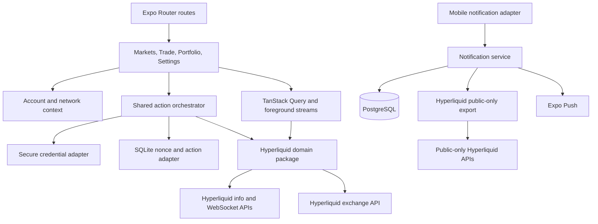
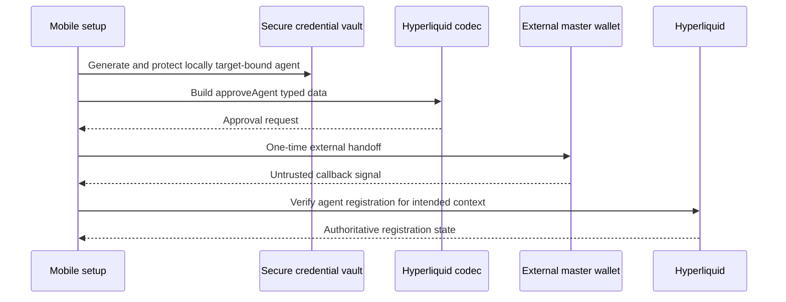
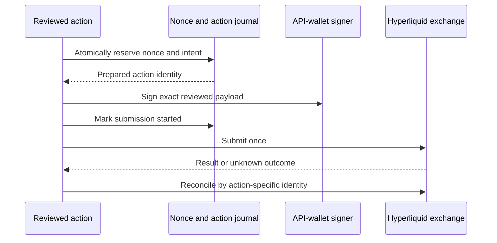
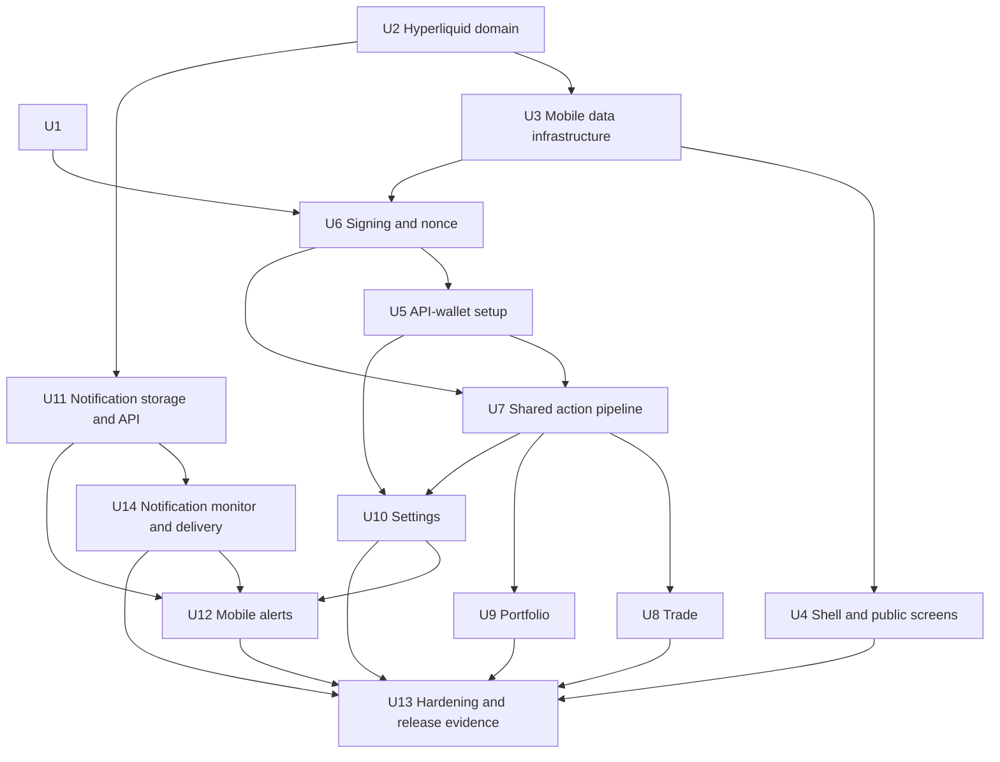

# Hyper Trader Native Trading App - Plan

> Historical status: the Welcome-specific onboarding requirements below were
> superseded by the current product contract in
> [`docs/design/mobile-screen-system.md`](../design/mobile-screen-system.md).
> First launch now opens read-only Trade directly; this file retains the
> original implementation-plan decisions for traceability.

## Goal Capsule

- **Objective:** Build the confirmed iOS and Android screen system as a testnet-functional Hyperliquid client with dynamic native-perpetual, HIP-3, and spot coverage; on-device API-wallet signing; portfolio control; multi-account settings; and closed-app notifications.
- **Authority order:** `docs/design/mobile-screen-system.md` owns product behavior. `docs/design/architecture.md` and this plan own implementation boundaries. Hyperliquid's official API documentation and official Python SDK own protocol behavior. Current Expo, HeroUI Native, Reown, TanStack Query, and Uniwind documentation own framework usage.
- **Execution profile:** Deep, staged implementation. Default tests are deterministic and offline. Live testnet, physical-device security, push-delivery, and release-build checks are separate verification gates.
- **Security gate:** Finish and review U1 before any `/exchange` submission path is enabled. Stop if the API-wallet custody design, signer vectors, nonce durability, revocation path, or secret-safe diagnostics fail review.
- **Network gate:** Mainnet signing and submission remain hard-disabled in every build covered by this plan. Stop if any route, deep link, restored draft, remote flag, or backend response can bypass that denial.
- **Protocol gate:** Stop authenticated work if locally produced addresses, action hashes, typed-data payloads, or signatures do not match committed vectors derived from the official Hyperliquid Python SDK.
- **Tail ownership:** U13 owns cross-unit cleanup, complete verification, documentation, examples, accessibility, performance evidence, and removal of abandoned implementation paths.

---

## Product Contract

### Summary

Implement the complete confirmed mobile screen system through explicit mobile, Hyperliquid-domain, signer, and notification-service boundaries. Deliver the public browsing experience first, then enable the reviewed testnet action pipeline, portfolio controls, settings, and notifications without extending scope into funding or mainnet execution.

### Problem Frame

The repository currently contains one read-only Expo Router screen and a small `allMids` client. It has no tab shell, dynamic market catalog, account model, wallet setup, signing, order state machine, portfolio workflows, notification service, or mobile integration-test harness.

Hyper Trader needs a native mobile experience that feels fast while remaining safe at signing and account boundaries. Public market reads can be cached and streamed aggressively. Private account state, API-wallet credentials, nonce state, action drafts, and reconciliation records require strict network and account isolation. An ambiguous post-signing result must never become an invitation to duplicate an action.

### Actors

- A1. **Read-only user:** Browses public markets without a connected account or signing credential.
- A2. **Trading user:** Connects a master account, authorizes a dedicated testnet API wallet, and manages orders and positions.
- A3. **External master wallet:** Signs the `approveAgent` typed-data request without exposing the master seed or private key to Hyper Trader.
- A4. **Notification service:** Monitors public account and market data and sends minimal push events without exchange or signing authority.
- A5. **Release reviewer:** Approves custody, signing compatibility, nonce, recovery, privacy, and mainnet-gate evidence before the corresponding capability may ship.

### Product Key Decisions

- **Hybrid onboarding:** Set up trading is primary, while read-only exploration remains immediately available. Governs R13-R19.
- **Session authentication:** Device authentication unlocks a short-lived in-memory signing session; each state-changing action still receives review. Governs R18, R26, R32, R38.
- **Trade-first home:** Trade is the default tab and restores the last valid market. Governs R1, R20.
- **Inline progressive order entry:** Trade owns the order panel and reveals advanced controls only when applicable. Governs R21-R25.
- **Performance-first portfolio:** Portfolio leads with account value and performance, then positions, orders, balances, and activity. Governs R29-R32.
- **Unified account view:** Spot and perpetual state share one portfolio with filters. Governs R30, R33.
- **Global multi-account support:** Each saved master account has isolated authorization, signer, nonce, preference, and cache state. Governs R2, R3, R33, R36-R39.
- **Configurable native alerts:** Execution, risk, price, and funding notifications use a backend that never receives signing authority. Governs R42-R46.

### Requirements

**Shared application behavior**

- R1. The app must expose Markets, Trade, Portfolio, and Settings as persistent bottom tabs, with Trade selected by default after entry.
- R2. Trade, Portfolio, action review, and signed-action results must show the active account and network.
- R3. An account or network change must cancel obsolete requests, invalidate incompatible drafts, lock the prior signer session, and isolate private state.
- R4. Read-only users must be able to browse every validated market without connecting a wallet.
- R5. Loading, stale, offline, empty, unavailable, and retry states must preserve the last trustworthy data when it is safe to display.
- R6. Controls and status changes must support native labels, focus order, touch targets, text scaling, reduced motion, and non-color cues.

**Market coverage and discovery**

- R7. The market catalog must come from current validated Hyperliquid metadata, not a hard-coded symbol list.
- R8. The catalog must cover native perpetuals, builder-deployed HIP-3 perpetuals, and spot pairs returned by supported metadata endpoints.
- R9. Each market must preserve canonical asset identity, venue, precision, margin mode, leverage limits, lifecycle state, and display name as separate validated fields.
- R10. A delisted, unavailable, or invalid market may remain viewable but must not expose an enabled order action.
- R11. Markets must support favorites, recents, search, and applicable filters for type, price change, volume, funding, and open interest.
- R12. A market selected from Markets or the Trade switcher must open in Trade without changing the active account or network.

**Onboarding and trading setup**

- R13. Welcome must present **Set up trading** as the primary action and **Explore read-only** as the secondary action.
- R14. Read-only onboarding must end after the welcome choice and teach concepts contextually.
- R15. Trading setup must connect a master account, generate a dedicated API wallet, show network and authority, obtain master approval, and verify registration before enabling trading.
- R16. Hyper Trader must never request or persist a master seed phrase or private key.
- R17. API-wallet loss, expiry, revocation, or biometric invalidation must use fresh-key reauthorization or rotation; the prior secret must never be shown as recovery material.
- R18. Setup must offer device authentication and explain the temporary-session boundary.
- R19. Skipped, interrupted, rejected, or failed setup must remain resumable from Trade, Portfolio, and Settings without replaying Welcome.

**Trade and action lifecycle**

- R20. Trade must reopen the last valid market and provide a complete searchable market switcher.
- R21. Trade must combine market identity, core statistics, charting, order-book or trade data, account context, and an inline order panel.
- R22. The inline panel must keep side, order type, applicable price, size, applicable leverage, available funds, and Review visible.
- R23. Trigger, TP/SL, reduce-only, time-in-force, slippage, and other controls must appear only when applicable.
- R24. Current network, metadata, precision, price, size, leverage, margin, reduce-only, and slippage rules must pass validation before review.
- R25. Review must show account, network, market, side, order behavior, price or trigger, size, leverage or margin mode, reduce-only state, estimated fees, and relevant slippage.
- R26. If the signing session expires during drafting or review, device authentication must restore only a revalidated draft.
- R27. Submission must distinguish accepted, rejected, expired, and unresolved outcomes and reconcile them against authoritative orders, fills, and positions.
- R28. The first complete trading delivery must support testnet market and limit orders, open orders, fills, position updates, cancellation, and position closing.

**Portfolio**

- R29. Portfolio must lead with total account value, absolute and percentage PnL, and a selectable time-range chart.
- R30. Portfolio must provide one account overview with filters for positions, open orders, spot balances, fills, funding, and supported activity.
- R31. Position rows must expose Close, TP/SL, and applicable margin actions without requiring a separate detail screen.
- R32. Portfolio actions must use the same validation, review, unlock, signing, result, and reconciliation pipeline as Trade.
- R33. Portfolio state must be isolated by master account, target subaccount or vault, and network.
- R34. Portfolio may show balances and deposit information but must not perform deposits, withdrawals, or internal transfers.
- R35. An external funding handoff must identify destination, account, and network before leaving the app.

**Settings and accounts**

- R36. Settings must manage multiple master accounts and separate API-wallet authorization, expiry, rotation, and revocation state.
- R37. The global account switcher must be available outside Settings and must reject a switch during signing or submission.
- R38. Security settings must expose session state, device-auth availability, timeout behavior, manual locking, and API-wallet revocation.
- R39. Public data, account data, authorization, nonce state, alerts, and action history must remain isolated between testnet and mainnet.
- R40. Trading preferences may provide safe defaults but must never suppress review or market-specific validation.
- R41. Settings must cover appearance, privacy, diagnostics, support, and legal or risk disclosures without mixing them into signing controls.

**Notifications**

- R42. Users must be able to configure fills, cancellations, rejections, margin risk, liquidation risk, price targets, and funding alerts.
- R43. Rules must be scoped to account, network, market, and event type.
- R44. A notification may restore its context only after target validation and user confirmation when the active account or network differs.
- R45. The notification service may store public account identifiers, device push tokens, hashed installation-credential records, verified account links, and alert rules, but never signing credentials, signed actions, or exchange authority.
- R46. Settings must support device-token revocation, account unlinking, and deletion of associated server-side alert data.

**Safety refinements confirmed for implementation**

- R47. Mainnet signing and submission must be denied by a local capability gate that cannot be enabled by remote configuration.
- R48. Review and signing require current validated market metadata, current account state, connectivity, and a non-expired action; stale data remains browse-only.
- R49. Unlinking an account must stop alert delivery, remove its local credential after pending-action reconciliation, and require an acknowledged external revocation or replacement step when the old agent remains registered.
- R50. A signed action with an unknown outcome must have a durable, account-scoped reconciliation record and must not be resubmitted as a new action.
- R51. Locked-device notification text and payloads must be minimal; full state must be fetched and validated after app entry.
- R52. An interrupted external-wallet approval must leave only a resumable, non-secret setup checkpoint and a securely stored pending agent key.
- R53. Portfolio Close must create a full-size reduce-only market draft by default, allow the user to adjust supported fields, and never submit without review.
- R54. Each API-wallet credential record must have an immutable local network, master-account, target-account, agent-address, and registration binding; Hyper Trader must require a different authorization for another target even if the protocol grants broader agent authority.
- R55. An external-wallet callback or deep link must never establish authority by itself; only a live single-use local attempt plus authoritative registration verification may advance setup.
- R56. An account-scoped notification rule must require current master-wallet proof for that installation, account, network, and purpose; an installation credential alone may create only price-only rules.
- R57. Agent rotation or emergency revocation must not report completion until authoritative state proves the old agent inactive; otherwise the account remains restricted and read-only.
- R58. Device revocation or account unlink must stop new provider submissions, drain active dispatch attempts before commit, and cancel matching unsent work; a push already accepted by the provider cannot be recalled and must remain visible as in-flight delivery history.

### Key Flows

- F1. **Read-only first launch**
  - **Trigger:** A1 selects **Explore read-only**.
  - **Steps:** Enter Trade, hydrate safe public cache, refresh metadata and market state, keep trading controls locked, and expose contextual setup entry points.
  - **Outcome:** All validated markets remain browseable without credentials.
  - **Covers:** R4, R7-R14, R19-R21.
- F2. **Trading setup**
  - **Trigger:** A2 selects setup from Welcome, Trade, Portfolio, or Settings.
  - **Steps:** Connect A3, bind account and testnet, generate and protect an API-wallet key, request `approveAgent`, survive external-app return, verify registration, and establish session policy.
  - **Outcome:** The account becomes testnet trading-ready without exposing the master key.
  - **Covers:** R15-R19, R36, R38, R39, R47, R52, R54, R55.
- F3. **Market-to-order**
  - **Trigger:** A user selects a market from Markets or Trade.
  - **Steps:** Restore context, create a metadata-bound draft, validate, review, unlock if needed, revalidate, sign, submit, classify, and reconcile.
  - **Outcome:** The action reaches a safe terminal or reconciling state.
  - **Covers:** R12, R20-R28, R47, R48, R50.
- F4. **Direct position management**
  - **Trigger:** A2 selects Close, TP/SL, or an applicable margin action from Portfolio.
  - **Steps:** Build a position-bound draft and run it through the shared action pipeline.
  - **Outcome:** The position can be managed quickly without bypassing review.
  - **Covers:** R31-R33, R53.
- F5. **Global account or network switch**
  - **Trigger:** A user selects another saved context.
  - **Steps:** Check action state, durably preserve unresolved reconciliation, invalidate drafts, cancel obsolete reads, lock the prior signer, isolate private caches, and restore the destination's last safe market.
  - **Outcome:** No credential, nonce, draft, or private data crosses contexts.
  - **Covers:** R2, R3, R33, R36-R39, R50.
- F6. **Agent rotation, revocation, or unlink**
  - **Trigger:** Expiry, local loss, biometric invalidation, manual rotation, or account unlink.
  - **Steps:** Lock the signer and reconcile pending actions. Rotation or revocation reaches completion only after authoritative state proves the old agent inactive, then removes the old local secret, tombstones its nonce scope, and initializes a separate scope only for a fresh agent. Local unlink may remove the key and scoped server alert data after explicit acknowledgement when external registration cannot be verified, but it must keep the retired nonce scope tombstoned and show the remaining registration risk.
  - **Outcome:** A completed rotation has a verified fresh agent and an inactive old agent; an unverified unlink remains visibly read-only with no local signing or alert capability.
  - **Covers:** R17, R36, R38, R46, R49, R57.
- F7. **Lifecycle and offline recovery**
  - **Trigger:** Cold start, warm resume, backgrounding, network loss, or WebSocket reconnect.
  - **Steps:** Render safe cache, lock in-memory signing material when required, reconnect once active, fetch authoritative snapshots, reconcile pending actions, and invalidate drafts whose context changed.
  - **Outcome:** Browsing resumes quickly and trading remains disabled until state is current.
  - **Covers:** R3, R5, R20, R26-R28, R48, R50.
- F8. **Notification entry**
  - **Trigger:** A foreground, background, or cold-start push is opened.
  - **Steps:** Resolve the alert record, validate account/network/market, ask before a context change, navigate to the safe destination, and fetch current state.
  - **Outcome:** The app shows current information or a clear missing/revoked-target state without acting on push payload data.
  - **Covers:** R42-R46, R51, R56, R58.

### Acceptance Examples

- AE1. **Covers R3, R25.** Given an ETH order draft for account A on testnet, when the user switches to account B, then the draft is invalidated and cannot appear in B's review.
- AE2. **Covers R7-R10.** Given a newly listed valid HIP-3 market, when metadata refresh completes, then it appears in search without an app update and uses returned constraints.
- AE3. **Covers R10, R24.** Given a delisted market or invalid precision metadata, when Trade opens it, then market data may remain visible but order submission is unavailable.
- AE4. **Covers R19.** Given the user rejects master-wallet approval, when they return to Trade, then read-only exploration works and setup remains resumable.
- AE5. **Covers R26, R48.** Given a valid draft and an expired signing session, when device authentication succeeds, then the app refreshes required state and restores only a still-valid draft.
- AE6. **Covers R27, R50.** Given submission times out after signing, when the outcome is unknown, then the app shows reconciliation, persists the correlation record, and does not offer a duplicate submission.
- AE7. **Covers R32, R53.** Given the user selects Close from Portfolio, when review opens, then the action is reduce-only and account, network, market, side, size, order behavior, and estimated impact are visible.
- AE8. **Covers R44.** Given an alert for account B arrives while account A is active, when the user opens it, then the app asks before activating B's context.
- AE9. **Covers R45, R46.** Given the user unlinks one account, when deletion completes, then its device association and alert rules are removed without affecting other accounts.
- AE10. **Covers R19, R52.** Given the app is terminated while an external wallet displays approval, when the user returns, then setup resumes from a non-secret checkpoint and verifies whether the pending agent became registered.
- AE11. **Covers R17, R49, R50.** Given agent rotation begins while an earlier action is unresolved, when the user continues, then rotation waits for durable reconciliation and never reuses the retired agent address.
- AE12. **Covers R24, R48.** Given leverage or precision metadata changes while the app is backgrounded, when it resumes, then the draft becomes expired and must be revalidated before review.
- AE13. **Covers R44, R51.** Given a notification targets a removed account or delisted market, when opened, then the current context remains unchanged and the app explains that the target is unavailable.
- AE14. **Covers R6, R27.** Given a screen-reader user submits an order, when its state changes, then review, submission, rejection, and reconciliation states are announced with non-color labels and predictable focus.
- AE15. **Covers R39, R47.** Given a mainnet draft is restored from cache or a deep link, when any signed-action entry point is invoked, then the local capability gate rejects it before key access or signing.
- AE16. **Covers R46, R49.** Given an account is unlinked, when external revocation cannot be confirmed, then the local key and alerts are removed, the remaining registration risk is shown, and other credentials remain untouched.
- AE17. **Covers R52, R55.** Given a forged, replayed, expired, or wrong-context wallet callback, when it reaches the app, then it cannot mutate setup or account context and registration remains unverified.
- AE18. **Covers R39, R54.** Given an API wallet bound to target A, when target B becomes active, then nonce allocation and signing reject that credential even if both targets share a master account.
- AE19. **Covers R45, R56.** Given a valid installation credential without master-wallet proof, when it attempts to link an account-scoped alert, then the service rejects the link without creating subscriptions or rules.
- AE20. **Covers R46, R58.** Given an outbox worker races with device revocation, when revocation begins, then new dispatch leases stop, active provider calls drain before commit, and no provider submission starts after commit.
- AE21. **Covers R17, R57.** Given an agent is replaced with a fresh address under the approved replacement policy, when authoritative verification completes, then the retired agent cannot submit and its nonce scope remains tombstoned.

### Success Criteria

- A warm resume renders a usable cached Trade screen within one second on the agreed baseline iOS and Android devices.
- Tab and market changes display safe cached content without waiting for a new network response.
- A returning user with an unlocked session can configure an order and reach review without leaving Trade.
- Account and network changes never carry incompatible drafts, private cache, signer sessions, pending actions, or notification context forward.
- Every submitted action reaches accepted, rejected, expired, or unresolved-and-reconciling state.
- New valid native-perpetual, HIP-3, and spot markets become discoverable without an app release.
- The testnet workflow passes deterministic and live-gated checks for market and limit orders, cancellation, fills, positions, and closing.
- A closed-app alert can open the intended safe context without using payload data as trading authority.

### Scope Boundaries

**Included**

- Native iOS and Android experiences only.
- Public mainnet browsing and isolated authenticated testnet trading.
- Dynamic native perpetual, HIP-3 perpetual, and spot coverage.
- Multiple master accounts, subaccount or vault targeting, dedicated device API wallets, and testnet actions.
- A portable Bun and PostgreSQL notification service with Expo Push delivery.

**Deferred to follow-up work**

- Mainnet signing and order submission, including its independent audit and release-control artifact.
- Additional master-wallet connector providers beyond the approved Reown AppKit path.
- In-app deposits, withdrawals, internal transfers, and bridging.
- Tablet-specific information architecture beyond a correct adaptive layout.

**Excluded by product identity**

- Master seed phrase or private-key custody.
- Server-side API-wallet signing, unattended trading, copy trading, and strategy automation.
- Expo web support.

### Dependencies

- Expo SDK 57 and its compatible React Native package versions.
- Current HeroUI Native and Uniwind v4 component anatomy and theme behavior.
- Reown AppKit React Native with the Wagmi/Viem adapter and a configured Reown project.
- Hyperliquid `/info`, `/exchange`, and WebSocket APIs on mainnet and testnet.
- PostgreSQL and Expo Push credentials for notification deployment.
- Physical iOS and Android devices with enrolled device authentication.

---

## Planning Contract

### Key Technical Decisions

- KTD1. **Preserve three trust domains.** Mobile routes and native adapters stay in `apps/mobile`; transport-independent Hyperliquid parsing, validation, action construction, and protocol messages stay in `packages/hyperliquid`; the notification runtime lives in `apps/notifications`. The shared package exports `@hyper-trader/hyperliquid/public` as a dedicated `/info` and public-stream surface with no signer, action, `/exchange`, or authenticated-account capability. The notification service may import only that entry point. This enforces R16 and R45 as a module boundary rather than an import convention.
- KTD2. **Use stable Expo Router JavaScript tabs.** `apps/mobile/src/app/(tabs)/_layout.tsx` uses `Tabs` from `expo-router`. Root modals own review and result surfaces. `GestureHandlerRootView` remains outermost and `HeroUINativeProvider` remains directly beneath it. The alpha native-tabs API is excluded.
- KTD3. **Use one canonical context identity and immutable signer binding.** All private state keys include network, master address, target account or vault address, and signer identity when signing state is involved. Each API wallet binds immutably to one network, master, target, agent address, and verified registration; target changes require a separate authorization under R54. The process-wide nonce coordinator remains keyed by network and agent address. Market identity uses venue plus canonical Hyperliquid asset ID, never display symbol alone.
- KTD4. **Build the market catalog from complete metadata.** Enumerate `perpDexs`; fetch `meta` and `metaAndAssetCtxs` for each DEX; fetch `spotMeta` and `spotMetaAndAssetCtxs`; preserve returned indexes and the spot order-asset rule. Invalid records enter a viewable quarantine state and never receive guessed constraints.
- KTD5. **Keep decimal and remote-data boundaries explicit.** Remote responses enter as `unknown` and pass small explicit validators. Decimal values remain strings at APIs and storage. `decimal.js` performs order, fee, margin, PnL, and slippage calculations; binary `Number` is presentation-only.
- KTD6. **Partition persistence by sensitivity and identity.** Persist public market cache and device-global presentation preferences in AsyncStorage. Scope recents and trading defaults by network, master, and target and delete them on unlink. Keep private query snapshots memory-only. Store the API-wallet secret and notification installation credential in separate SecureStore records. Store non-secret nonce and pending-action state in SQLite without raw secrets, signatures, or complete signed payloads.
- KTD7. **Make SecureStore access the signer unlock boundary.** Generate 32 random bytes with `expo-crypto`. On iOS use non-migrating device-only accessibility with `requireAuthentication`; on Android use authenticated Keystore-backed storage excluded from backup. Use `expo-local-authentication` for capability and enrollment checks, then load the secret once into a five-minute in-memory session. Clear it on manual lock, background or inactive transition, context change, timeout, biometric invalidation, and app termination. A missing install sentinel with a surviving iOS Keychain record forces fresh authentication, account selection, and registration verification. Rooted or jailbroken operating systems are outside the custody guarantee; explicit platform integrity or key-access failure must fail closed.
- KTD8. **Use Reown AppKit with Wagmi/Viem for the first master-wallet handoff** `(session-settled: user-approved — chosen over an unspecified multi-provider connector layer: one current native path keeps setup and return-state handling testable)`. The compatibility polyfill loads before wallet imports. Each setup creates a random, single-use, expiring attempt bound to connector session, intended network, master, target, and generated agent. Wallet callbacks and custom schemes are parse-only untrusted input. Only the local attempt plus authoritative registration verification can make the account ready. Prefer owned Universal or App Links where supported.
- KTD9. **Own a small auditable Hyperliquid action codec** `(session-settled: user-approved — chosen over a complete third-party trading SDK: the repository keeps protocol validation and signing at its existing typed trust boundary)`. Use `@msgpack/msgpack` for canonical action bytes and Viem for Keccak, secp256k1, and EIP-712. Commit compatibility fixtures from the official Python SDK for `approveAgent` and every supported L1 action before enabling submission.
- KTD10. **Reserve each action atomically before signing.** `packages/hyperliquid` owns pure nonce rules and repository ports; `apps/mobile` owns the process-wide queue and SQLite implementation. One SQLite transaction allocates `max(currentMilliseconds, lastIssuedNonce + 1)` and inserts the immutable prepared journal row under unique network-agent-nonce, correlation, and `cloid` constraints. A partial uniqueness rule blocks an equivalent action fingerprint only while its prior record is nonterminal. Persist `submission_started` before the first transport write. After that marker, the action may only reconcile and never submit again. A lease with expiry ensures only one foreground reconciler owns a record. Retired signer scopes remain tombstoned and never issue again.
- KTD11. **Use one fenced action state machine.** Trade and Portfolio dispatch the same pipeline under KTD10. The reviewed snapshot captures a context epoch; every asynchronous effect verifies it before and after completion. New orders and order-based closes use a random 128-bit `cloid`. Cancels use target order and asset identity. Leverage changes use asset, margin mode, and target value. Every action stores an immutable secret-free intent digest, expiry, nonce, action type, and reconciliation key. An equivalent action remains blocked until authoritative reconciliation and expiry policy make a new intent safe.
- KTD12. **Use one foreground WebSocket manager.** A shared manager maintains declared subscriptions, sends heartbeats during quiet periods, reconnects with bounded jitter, and refreshes HTTP snapshots before accepting deltas. App backgrounding closes live subscriptions. The notification backend, not mobile background work, owns closed-app monitoring.
- KTD13. **Hard-deny mainnet action capability** `(session-settled: user-approved — chosen over a remote feature flag: restored state and external input cannot unlock live execution)`. Endpoint selection and signing source remain network-aware, but every call that can access a signer or `/exchange` first checks a compile-owned capability matrix where mainnet is false.
- KTD14. **Use a portable Bun/PostgreSQL notification service** `(session-settled: user-approved — chosen over platform-specific serverless infrastructure: an always-on service can maintain public Hyperliquid streams and remain deployment-portable)`. `Bun.serve` exposes bounded device and rule APIs. PostgreSQL stores hashed installation credentials, encrypted Expo tokens with hashed fingerprints, verified public account links, rules, dedupe keys, and an outbox. Admission defaults are 64 KiB request bodies, 10 linked account targets and 100 active rules per installation, per-IP and per-installation mutation limits, and shared upstream utilization below 70% of documented Hyperliquid connection, subscription, and weighted-request budgets.
- KTD15. **Minimize notification retention and make deletion survive restore.** Active installation and rule records live until revoke or unlink. Delivery metadata expires after 30 days. Dedupe keys expire after 7 days. Raw market, account, and push payloads are not retained after evaluation. A deletion tombstone ledger outlives the maximum encrypted-backup window and replays before workers restart after restore. Push payloads contain an opaque alert ID and minimal context IDs, not balances, positions, or order details.
- KTD16. **Use query ownership instead of a global reset.** TanStack Query keys come from factories that include KTD3 identity. Account or network changes cancel obsolete requests before removing only incompatible private keys. Public cache remains available. `onlineManager` follows network state and `focusManager` follows React Native `AppState`.
- KTD17. **Use separate deterministic and native test layers.** Bun tests cover package, reducer, state-machine, and service logic. `jest-expo` plus React Native Testing Library covers routes and native UI using a non-Bun-discovered filename convention. Maestro covers release-build user journeys. Live Hyperliquid and push checks require explicit opt-in and never run in the default suite.
- KTD18. **Prove account control before account-scoped alerts.** Price-only rules require only the installation credential. Linking an account requires a short-lived, one-time master-wallet proof bound to installation, account, network, purpose, and expiry. The service retains the verified link, not the proof or signature. A bearer installation credential may manage proven links but cannot create or rebind one.
- KTD19. **Treat release and transport integrity as part of signer custody.** Signing-capable builds use signed EAS Updates; if update-code signing is not configured, OTA updates are disabled. HTTPS and WSS origins are compiled per network, reject overrides and redirects, and fail closed on TLS errors. Certificate pinning is not assumed. Reown configuration, native config plugins, update credentials, lockfile changes, and dependency upgrades require controlled review and incident rotation procedures.
- KTD20. **Fence asynchronous work with a context epoch.** The mobile context supervisor increments an epoch before account, target, or network changes. Drafts and pre-submit effects must match the captured epoch before they can commit. Once KTD10 creates a durable action reservation, its scoped reconciler may continue without signer access, but it cannot update another active context or resubmit.
- KTD21. **Use transactional at-least-once push delivery.** One PostgreSQL transaction claims the event dedupe key and inserts the alert and outbox row. Database uniqueness protects installation hashes, token fingerprints, account links, rule identity, event keys, and provider ticket IDs. Workers use expiring leases. A crash after provider acceptance may duplicate a push, so stable alert IDs and mobile deduplication provide bounded at-least-once behavior rather than an exactly-once claim.
- KTD22. **Fence revoke and unlink against delivery and rotation.** Revocation enters a draining state that rejects new dispatch leases, waits for active provider calls to finish, then commits the inactive link, cancels unsent outbox rows, deletes scoped rules, and writes the KTD15 tombstone. A provider-accepted push may arrive later and remains recorded as in flight; no provider submission starts after commit. API-wallet rotation uses a stable protocol-valid agent name to replace the prior address, verifies the old agent inactive, and tombstones its signer scope; unavailable verification leaves the account read-only under R57.

### High-Level Technical Design

Setup and trading use different authorities and cannot substitute for one another:

The action lifecycle is the safety spine shared by Trade and Portfolio:

```mermaid
stateDiagram-v2
  [*] --> Draft
  Draft --> Invalidated: context or metadata changes
  Draft --> Reviewed: local validation passes
  Reviewed --> Draft: user edits
  Reviewed --> Unlocking: user confirms
  Unlocking --> Reviewed: unlock fails or state changed
  Unlocking --> Prepared: refresh passes; nonce and journal commit
  Prepared --> Signing: context epoch still matches
  Signing --> SubmissionStarted: attempt marker persisted
  SubmissionStarted --> Reconciling: restart or transport outcome unknown; never write again
  SubmissionStarted --> Submitting: first transport write
  Submitting --> Accepted
  Submitting --> Rejected
  Submitting --> Expired
  Submitting --> Unresolved
  Unresolved --> Reconciling
  Reconciling --> Accepted
  Reconciling --> Rejected
  Reconciling --> Expired
```

### Data Ownership

| Data | Owner | Persistence | Isolation rule |
|---|---|---|---|
| Public catalog and market snapshots | TanStack Query | AsyncStorage cache | Network plus canonical market identity |
| Appearance and device-global presentation preferences | Mobile preferences | AsyncStorage | Device installation |
| Favorites, recents, and trading defaults | Mobile preferences | AsyncStorage | Network plus master and target account where applicable |
| Private portfolio and order snapshots | TanStack Query | Memory only | Network plus master and target account |
| API-wallet private key | Native credential vault | SecureStore | Network plus master plus target plus agent address |
| Unlocked signer | Signer-session provider | Memory only | One account and network; cleared on lifecycle rules |
| Nonce counter | Nonce repository | SQLite | Network plus agent address |
| Pending action journal | Reconciliation repository | SQLite | Network plus master, target, agent, correlation, and action fingerprint |
| Notification installation credential | Native notification adapter | SecureStore | Device installation |
| Alert rules and delivery records | Notification service | PostgreSQL | Verified installation link, account, network, market, and event type |

### Implementation Constraints

- Install Expo-managed native packages with `npx expo install` from `apps/mobile` so SDK-compatible versions are selected.
- Rebuild development clients after native dependency or config-plugin changes. Expo Go is not an acceptance environment for secure authentication or remote push.
- Fetch current HeroUI Native documentation before adding each component. Use granular Native imports, compound anatomy, semantic tokens, and React Native `onPress`.
- Propagate `AbortSignal` through every request that TanStack Query owns.
- Never log private keys, complete signed actions, raw signatures, full notification device tokens, or SecureStore values.
- Redact master addresses in analytics and diagnostics unless the user explicitly exports a local diagnostic bundle.
- Treat wallet callbacks, notification intents, remote responses, and database values as untrusted inputs with bounded parsers and no direct authority transitions.
- Compile fixed HTTPS and WSS origins per network. Reject redirects, URL overrides, and untrusted update channels under KTD19.
- Set retry to zero for exchange submissions and credential mutations. Retriable reads use bounded backoff and jitter.
- Use HTTP snapshots on initial load and after reconnect. WebSocket deltas never establish the initial authoritative state alone.
- Treat Hyperliquid response types as unversioned remote data. Keep fixtures for unknown fields, missing fields, and changed lifecycle states.
- Keep the default authenticated network testnet even when public mainnet data is shown.

### Sequencing and Work Relationships

U2 may start while U1 is under review because it is read-only and transport-safe. U6 begins after U1 is accepted and U3 supplies the persistence ports. U5 may not enable a real `approveAgent` handoff until U6 approval vectors pass. U7 may exercise mocked transport before the gate, but it must not enable live `/exchange` submission until U1 review evidence and all U6 vectors pass. U14 activates monitoring and delivery only after U11 migrations, rollback, authorization, revocation, retention, and restore checks pass.

### System-Wide Impact

- **Navigation:** The single Stack screen becomes a root Stack with Welcome, setup, a four-tab group, review modal, result surface, and safe notification intent rewriting.
- **Data lifecycle:** A single global mainnet query becomes explicit network, account, target, market, signer, and action identities with cancellation and selective eviction.
- **Security:** The app gains a locally target-bound trading credential, a short-lived in-memory signer, one-time external handoffs, signed-update requirements, fixed origins, and auditable recovery paths.
- **Protocol:** The shared package grows from `allMids` into validated market, account, exchange, signing-message, and reconciliation domains while remaining React Native independent.
- **Operations:** The repository gains an always-on notification service, forward and rollback PostgreSQL migrations, transactional outbox delivery, deletion tombstones, rate budgets, and credential-rotation runbooks.
- **Testing:** The repository adds native component, release-build journey, signer-vector, state-machine, service, and opt-in live-testnet layers.

### Risks and Mitigations

| Risk | Impact | Mitigation |
|---|---|---|
| Hyperliquid's unversioned API changes | Parser failure or unsafe guessed constraints | Validate `unknown`, quarantine invalid markets, retain fixtures, and fail closed for actions. |
| Signer encoding differs from protocol | Rejected actions or incorrect signatures | Require official-SDK parity vectors for each action and both networks before submission. |
| Nonce or journal split-brain after a crash | Rejection, replay, or duplicate intent | Use KTD10 atomic reservation, database uniqueness, fault injection, reconciliation leases, and retired-scope tombstones. |
| External wallet callback is interrupted or forged | Orphaned agent or unauthorized setup transition | Bind a one-time attempt, parse callbacks without authority, and advance only from registration reads. |
| SecureStore entry becomes inaccessible | Trading lockout | Treat the agent as revocable; generate a fresh key and repeat master approval. |
| Unknown non-order action is retried | Duplicate or conflicting cancel, leverage, or close intent | Use action-specific journal identities and block equivalents until authoritative reconciliation. |
| Cache leaks across accounts or networks | Privacy and trading-context failure | Use KTD3 query keys, cancellation-before-eviction, memory-only private cache, and isolation tests. |
| Background mobile execution is unreliable | Missed alerts or stale portfolio | Use the notification service for monitoring and refresh snapshots on foreground. |
| Push tokens rotate or receipts fail | Silent alert loss | Listen for token changes, process Expo receipts, mark delivery health, and prompt repair in Settings. |
| Notification backend imports action capability | Server-side signing boundary violation | Export a public-only package surface and add import and payload guards in service tests. |
| Revocation races an outbox worker | Push after deletion | Commit KTD22 revocation atomically and recheck authorization immediately before provider submission. |
| Notification traffic exhausts upstream limits | Delayed or lost alerts for other users | Enforce KTD14 admission limits, shared monitors, capacity metrics, and fail-closed overload behavior. |
| Reown or pre-1.0 dependencies change | Build or handoff regression | Pin tested versions, use Renovate-style reviewed updates later, and retain external-return integration fixtures. |
| Mainnet context reaches signer code | Accidental live action | Enforce KTD13 at the orchestrator and exchange client with denial tests for every entry path. |
| OTA or dependency compromise changes signer code | Credential theft or capability-gate bypass | Require KTD19 signed updates or disabled OTA, fixed origins, provenance review, and credential-rotation drills. |

### Sources and Research

- Repository entry points: `apps/mobile/src/app/_layout.tsx`, `apps/mobile/src/app/index.tsx`, `packages/hyperliquid/src/index.ts`, and `packages/hyperliquid/src/index.test.ts`.
- Product authority: `docs/design/mobile-screen-system.md`.
- Architecture authority: `docs/design/architecture.md`.
- [Hyperliquid nonces and API wallets](https://hyperliquid.gitbook.io/hyperliquid-docs/for-developers/api/nonces-and-api-wallets).
- [Hyperliquid exchange endpoint](https://hyperliquid.gitbook.io/hyperliquid-docs/for-developers/api/exchange-endpoint).
- [Hyperliquid info endpoint](https://hyperliquid.gitbook.io/hyperliquid-docs/for-developers/api/info-endpoint).
- [Hyperliquid perpetual metadata](https://hyperliquid.gitbook.io/hyperliquid-docs/for-developers/api/info-endpoint/perpetuals) and [spot metadata](https://hyperliquid.gitbook.io/hyperliquid-docs/for-developers/api/info-endpoint/spot).
- [Hyperliquid WebSocket subscriptions](https://hyperliquid.gitbook.io/hyperliquid-docs/for-developers/api/websocket/subscriptions), [heartbeats](https://hyperliquid.gitbook.io/hyperliquid-docs/for-developers/api/websocket/timeouts-and-heartbeats), and [rate limits](https://hyperliquid.gitbook.io/hyperliquid-docs/for-developers/api/rate-limits-and-user-limits).
- [Official Hyperliquid Python signing implementation](https://github.com/hyperliquid-dex/hyperliquid-python-sdk/blob/master/hyperliquid/utils/signing.py).
- [Expo Router tabs](https://docs.expo.dev/router/advanced/tabs/) and [native intent rewriting](https://docs.expo.dev/router/advanced/native-intent/).
- [Expo SecureStore](https://docs.expo.dev/versions/latest/sdk/securestore/), [LocalAuthentication](https://docs.expo.dev/versions/v57.0.0/sdk/local-authentication/), and [Notifications](https://docs.expo.dev/versions/v57.0.0/sdk/notifications/).
- [EAS Update code signing](https://docs.expo.dev/eas-update/code-signing/).
- [TanStack Query React Native guidance](https://tanstack.com/query/latest/docs/framework/react/react-native).
- [HeroUI Native quick start](https://heroui.com/en/docs/native/getting-started/quick-start) and [provider anatomy](https://heroui.com/en/docs/native/getting-started/provider).
- [Reown AppKit React Native installation](https://docs.reown.com/appkit/react-native/core/installation) and [redirect options](https://docs.reown.com/appkit/react-native/core/options).
- [Viem typed-data signing](https://viem.sh/docs/accounts/local/signTypedData) and [private-key accounts](https://viem.sh/docs/accounts/local/privateKeyToAccount).

---

## Implementation Units

| Unit | Title | Primary files | Depends on |
|---|---|---|---|
| U1 | Security and operational design gate | `docs/design/`, `docs/implementation/` | None |
| U2 | Hyperliquid market and account domain | `packages/hyperliquid/src/` | None |
| U3 | Mobile data, context, and lifecycle infrastructure | `apps/mobile/src/core/` | U2 |
| U4 | Four-tab shell, onboarding, and Markets | `apps/mobile/src/app/`, `apps/mobile/src/features/markets/` | U2, U3 |
| U5 | API-wallet setup and signer session | `apps/mobile/src/features/accounts/`, `apps/mobile/src/platform/security/` | U1, U3, U6 |
| U6 | Action codec, signing, nonce, and journal | `packages/hyperliquid/src/signing/`, `apps/mobile/src/platform/persistence/` | U1-U3 |
| U7 | Shared action orchestration and reconciliation | `packages/hyperliquid/src/actions/`, `apps/mobile/src/features/actions/` | U3, U5, U6 |
| U8 | Complete Trade screen | `apps/mobile/src/features/trade/` | U4, U7 |
| U9 | Unified Portfolio screen and quick actions | `apps/mobile/src/features/portfolio/` | U7 |
| U10 | Settings, accounts, security, and preferences | `apps/mobile/src/features/settings/` | U5, U7 |
| U11 | Notification contracts, authorization, and storage | `apps/notifications/`, `packages/notifications/` | U2 |
| U14 | Notification monitoring and delivery workers | `apps/notifications/src/monitor/`, `apps/notifications/src/push/` | U11 |
| U12 | Mobile notification rules and safe entry | `apps/mobile/src/features/notifications/` | U10, U11, U14 |
| U13 | Production hardening and release evidence | Cross-cutting docs, tests, and examples | U4, U8-U12, U14 |

### U1. Security and operational design gate

- **Goal:** Turn the approved architecture into reviewable custody, signing, nonce, reconciliation, notification-privacy, and incident contracts before state-changing transport is enabled.
- **Requirements:** R15-R18, R26-R28, R36, R38, R39, R45, R47, R49-R58.
- **Dependencies:** None.
- **Files:** `docs/design/api-wallet-custody.md`, `docs/design/action-lifecycle.md`, `docs/design/notification-service.md`, `docs/design/architecture.md`, `docs/implementation/security-review.md`, `docs/implementation/setup.md`.
- **Approach:**
  - Document local target binding, agent generation, stable replacement naming, slot availability, expiry, registration proof, platform-specific SecureStore policy, biometric invalidation, session timeout, rotation, external revocation, loss, reinstall, backup, compromised-device boundary, and account unlink.
  - Document byte ownership from action intent through signature and transport. Mark every location where secrets and signatures are prohibited.
  - Define nonce persistence, queue ownership, clock-skew handling, `expiresAfter`, journal fields, `cloid`, unknown-outcome recovery, and context-switch rules.
  - Define the mainnet hard-denial locations and the separate evidence required by a future mainnet plan.
  - Define notification ownership proof, installation authority, quotas, encrypted token storage, retention, tombstones, deletion races, push payload policy, restore behavior, and operational incident handling.
  - Define signed-update or disabled-OTA policy, fixed network origins, dependency and config-plugin review, and rotation of update, Reown, and push credentials.
  - Add a review checklist that requires protocol, mobile-security, privacy, and recovery sign-off before U5-U7 live integration.
- **Test Scenarios:** Threat-model lost or compromised device, biometric enrollment change, surviving iOS Keychain entry after reinstall, external callback forgery, signer rotation during unresolved action, clock rollback, notification credential theft, outbox/delete race, unsigned update, endpoint override, and accidental mainnet context.
- **Verification:** A reviewer can trace every secret, non-secret durable record, external authority, deletion path, and stop condition without consulting application code.

### U2. Hyperliquid market and account domain

- **Goal:** Expand the shared package into a validated, runtime-discovered, transport-independent public and account-data domain that every screen and service can share.
- **Requirements:** R7-R12, R20-R25, R29, R30, R33, R48.
- **Dependencies:** None.
- **Files:** `packages/hyperliquid/src/index.ts`, `packages/hyperliquid/src/public.ts`, `packages/hyperliquid/src/network.ts`, `packages/hyperliquid/src/errors.ts`, `packages/hyperliquid/src/transport/http.ts`, `packages/hyperliquid/src/transport/websocket.ts`, `packages/hyperliquid/src/markets/`, `packages/hyperliquid/src/accounts/`, `packages/hyperliquid/src/numbers/`, `packages/hyperliquid/package.json`, colocated tests and fixtures, `examples/market-catalog.ts`, `examples/account-snapshot.ts`.
- **Approach:**
  - Preserve the existing injected-`fetch`, `unknown` parsing, typed network, and decimal-string patterns while splitting the public facade into focused modules.
  - Implement complete DEX enumeration and native-perp, HIP-3, and spot metadata/context aggregation under KTD4.
  - Define canonical market identity independently from display symbol. Preserve order asset IDs, DEX names, universe indexes, `szDecimals`, price precision inputs, lifecycle state, margin mode, and maximum leverage.
  - Add public reads for mids, candles, L2 book, trades, funding, and applicable contexts. Add account reads for subaccounts, vault targets, clearinghouse state by DEX, spot state, open and historical orders, fills, funding, and order status.
  - Normalize account data without merging away source identity. Query target master, subaccount, or vault addresses rather than API-wallet addresses.
  - Add rate weights and request-budget metadata so mobile and service callers can coalesce and back off centrally.
  - Export a public-only subpath with no action builder, signer, authenticated account helper, or exchange submission dependency.
- **Test Scenarios:** Multiple HIP-3 DEXes, symbol collisions, spot asset-ID offset, delisted markets, invalid precision, isolated-only assets, unknown fields, partial endpoint failure, empty account, subaccount/vault target, decimal preservation, abort, rate limit, and network endpoint isolation.
- **Verification:** `bun test packages/hyperliquid` passes with no live network access; examples compile and operate only when explicitly executed.

### U3. Mobile data, context, and lifecycle infrastructure

- **Goal:** Establish the global safety and performance spine for account/network context, query ownership, public-cache hydration, foreground streams, draft invalidation, and app lifecycle.
- **Requirements:** R2-R6, R20, R26, R27, R33, R37, R39, R44, R48, R50.
- **Dependencies:** U2.
- **Files:** `apps/mobile/src/app/_layout.tsx`, `apps/mobile/src/core/context/`, `apps/mobile/src/core/query/`, `apps/mobile/src/core/lifecycle/`, `apps/mobile/src/core/streams/`, `apps/mobile/src/core/storage/`, `apps/mobile/src/core/actions/draft-context.ts`, `apps/mobile/package.json`, `apps/mobile/app.json`.
- **Approach:**
  - Keep the required provider adjacency and install account/network, query-persistence, app-lifecycle, stream, signer-session, and notification-intent providers below HeroUI Native.
  - Implement KTD3 identifiers and query-key factories. Cancel requests before a context commit, then remove only incompatible private data.
  - Implement KTD20's monotonically increasing context epoch and require pre-submit asynchronous work to present the captured epoch before committing.
  - Persist only allowlisted public query families. Restore Trade cache before refreshing. Keep account snapshots memory-only.
  - Wire TanStack `onlineManager` to `expo-network` and `focusManager` to `AppState`. Propagate cancellation to the shared client.
  - Build one foreground WebSocket manager with declarative subscriptions, heartbeat, reconnect, HTTP baseline refresh, and delta deduplication.
  - Bind each order draft to account, network, canonical market, and metadata fingerprint. Invalidate with a user-visible reason on any incompatible change.
- **Test Scenarios:** Warm resume, cold start without cache, offline browsing, reconnect, network switch with in-flight reads, late completion after an account switch, draft invalidation, metadata fingerprint change, background session lock, WebSocket gap, duplicate delta, and large-text lifecycle banners.
- **Verification:** Pure state and query-key tests pass under Bun; AppState and network integrations pass in the mobile test harness; measured warm cache hydration meets the one-second target on baseline devices during U13.

### U4. Four-tab shell, hybrid onboarding, and Markets

- **Goal:** Replace the starter dashboard with the confirmed native navigation model and a complete read-only market-discovery experience.
- **Requirements:** R1, R4-R14, R19-R21.
- **Dependencies:** U2, U3.
- **Files:** `apps/mobile/src/app/index.tsx`, `apps/mobile/src/app/welcome.tsx`, `apps/mobile/src/app/(tabs)/_layout.tsx`, `apps/mobile/src/app/(tabs)/markets.tsx`, `apps/mobile/src/app/(tabs)/trade.tsx`, `apps/mobile/src/app/(tabs)/portfolio.tsx`, `apps/mobile/src/app/(tabs)/settings.tsx`, `apps/mobile/src/features/onboarding/`, `apps/mobile/src/features/markets/`, `apps/mobile/src/components/`.
- **Approach:**
  - Make first launch route to Welcome and subsequent launches route to the tab shell. Make Trade the initial tab.
  - End read-only onboarding immediately after the secondary choice. Show contextual setup prompts in locked Trade, Portfolio, and Settings states.
  - Implement Markets with favorites, recents, search, filter chips, sort controls, complete catalog states, and navigation to Trade.
  - Implement the Trade header and market switcher with the last valid market and a dynamic volume-ranked fallback when the prior market becomes invalid.
  - Provide skeleton, stale, offline, empty, partial-unavailable, quarantined, and retry states without blocking safe cached browsing.
  - Replace starter copy that says the app stores no private keys with precise language that distinguishes master keys from protected API-wallet keys.
- **Test Scenarios:** First launch choices, returning read-only user, setup resume entry, new HIP-3 listing, delisted last market, search collision, filter applicability, empty cache offline, disabled trading control, focus order, reduced motion, and screen-reader status labels.
- **Verification:** Route tests prove Trade-default entry and tab persistence; component tests prove all market and onboarding states; no market is excluded by a presentation allowlist.

### U5. API-wallet setup and signer session

- **Goal:** Deliver a resumable, testnet-only external master-wallet approval flow and device-bound API-wallet lifecycle without exposing the master credential.
- **Requirements:** R13, R15-R19, R26, R36, R38, R39, R47, R49, R52, R54, R55, R57.
- **Dependencies:** U1, U3, U6.
- **Files:** `apps/mobile/src/app/setup/`, `apps/mobile/src/features/accounts/`, `apps/mobile/src/features/security/`, `apps/mobile/src/platform/wallet/`, `apps/mobile/src/platform/security/credential-vault.ts`, `apps/mobile/src/platform/security/device-auth.ts`, `apps/mobile/src/platform/security/agent-signer.ts`, `apps/mobile/src/core/session/`, `apps/mobile/src/+native-intent.tsx`, `apps/mobile/app.json`, `apps/mobile/package.json`.
- **Approach:**
  - Install and configure Reown AppKit, Wagmi/Viem, the required React Native compatibility import, deep-link scheme, wallet discovery settings, SecureStore, LocalAuthentication, and Expo Crypto.
  - Model setup as connect, verify account and target, check agent-slot policy, generate the protected locally target-bound agent, create the single-use attempt, request approval, handle untrusted external return, verify registration, configure the session, and reach ready or recoverable failure.
  - Store the pending agent secret before external handoff. Persist only the expiring attempt identity and non-secret checkpoint outside SecureStore.
  - Refuse cross-target credential reuse. Query registration state rather than treating any wallet callback as approval success.
  - Detect device-auth absence, biometric change, lost SecureStore entry, agent expiry, and external revocation. Route each to read-only or fresh-key reauthorization.
  - Support multiple master accounts and targets without sharing attempts, connector state, credentials, preferences, nonce scopes, or sessions.
- **Test Scenarios:** Wallet unavailable, user cancellation, wrong account, wrong target, wrong network, forged or duplicate callback, expired attempt, callback after rotation or unlink, app kill during approval, agent registered while closed, denied device auth, surviving reinstall record, rotation verification, and hard mainnet denial.
- **Verification:** Automated tests use fake wallet, vault, auth, and registration adapters; physical-device checks cover iOS Face ID and Android strong biometrics in a development build.

### U6. Action codec, signing, nonce, and pending journal

- **Goal:** Produce protocol-compatible testnet signatures and durable per-agent ordering without letting native secret access enter the shared package.
- **Requirements:** R15-R17, R24-R28, R32, R36, R38, R39, R47, R50, R54, R57.
- **Dependencies:** U1, U2, U3.
- **Files:** `packages/hyperliquid/src/actions/`, `packages/hyperliquid/src/signing/`, `packages/hyperliquid/src/nonces/`, `packages/hyperliquid/src/reconciliation/`, `packages/hyperliquid/src/fixtures/signing/`, `apps/mobile/src/platform/persistence/nonce-repository.ts`, `apps/mobile/src/platform/persistence/action-journal.ts`, package manifests and colocated tests.
- **Approach:**
  - Define typed intents and exchange payload builders for market and limit order, cancel by order ID or `cloid`, bulk cancel, leverage update where needed, and reduce-only close.
  - Encode L1 actions with canonical msgpack, nonce, optional vault address, and bounded `expiresAfter`; encode `approveAgent` with the correct user-signed EIP-712 domain.
  - Keep the shared signing boundary as bytes or typed-data in and signature out. Inject the mobile signer implementation.
  - Create official-SDK parity fixtures for action bytes, hashes, domains, addresses, and signatures on testnet and mainnet sources. Mainnet vectors verify encoding only and never enable submission.
  - Keep pure nonce allocation, journal state rules, and repository interfaces in the package. Keep SQLite transactions, queue lifecycle, leases, and recovery in mobile adapters.
  - Atomically reserve nonce and prepared intent under KTD10. Mark submission start before transport. Never persist raw private keys, raw signatures, or complete signed payloads.
  - Define database uniqueness for network-agent nonce, `cloid`, and correlation; enforce action-fingerprint uniqueness only across nonterminal records; allow one active reconciliation lease. Tombstone retired agent scopes.
- **Test Scenarios:** Every action vector, vault address, network source separation, independent-connection nonce races, duplicate correlation and fingerprint insertion, lease expiry, restart, clock rollback, cross-target signer misuse, agent rotation, every persistence/transport crash point, expiry, and secret-log redaction.
- **Verification:** All vectors match the pinned official SDK reference; fault injection proves no nonce reuse or duplicate submit; package dependency checks prove no Expo, SQLite, SecureStore, or React Native import.

### U7. Shared action orchestration and reconciliation

- **Goal:** Implement one state-changing pipeline for Trade and Portfolio with pre-sign refresh, explicit review, safe result classification, and durable recovery.
- **Requirements:** R2, R3, R24-R28, R31, R32, R37, R39, R47, R48, R50, R53, R54.
- **Dependencies:** U3, U5, U6.
- **Files:** `packages/hyperliquid/src/actions/validation.ts`, `packages/hyperliquid/src/actions/exchange-client.ts`, `packages/hyperliquid/src/reconciliation/`, `apps/mobile/src/features/actions/action-flow-sheet.tsx`, `apps/mobile/src/app/_layout.tsx`, `apps/mobile/src/core/session/`, colocated tests and fixtures, `examples/testnet-order-workflow.ts`.
- **Approach:**
  - Implement decimal-safe validation for price, size, precision, notional, leverage, margin availability, reduce-only, time-in-force, trigger, slippage, tradability, and current context.
  - Build the action state machine in KTD11 as a pure reducer plus effect adapters.
  - Open review as a root modal so the underlying Trade or Portfolio context remains mounted. Never sign on modal entry.
  - On confirmation, unlock if needed, refresh and revalidate, verify signer binding and context epoch, atomically reserve the action, sign, persist submission start, and submit once.
  - Reconcile each action through KTD11's action-specific identity. `cloid` is authoritative for order creates; non-create actions use their immutable intent and current account-state evidence.
  - Invalidate pre-reservation work on context epoch changes. Permit switching after an unresolved record is durable while its scoped, signer-free reconciliation lease continues without resubmission or cross-context cache updates.
- **Test Scenarios:** Stale review, insufficient margin, precision change, expired session, unlock failure, context switch during refresh, late signer completion, REST rejection, timeout before and after transport for each action type, termination at every journal boundary, fill before response, reconnect, duplicate response, reconciliation lease takeover, and mainnet entry through every public action method.
- **Verification:** Deterministic workflow tests cover market and limit create, cancel, full close, accepted, rejected, expired, and unresolved paths without a live exchange; the opt-in live testnet example remains guarded by an explicit environment switch.

### U8. Complete Trade screen

- **Goal:** Deliver the fast, inline, progressive Trade experience on top of the shared action pipeline.
- **Requirements:** R2, R6, R10, R12, R20-R28, R47, R48.
- **Dependencies:** U4, U7.
- **Files:** `apps/mobile/src/app/(tabs)/trade.tsx`, `apps/mobile/src/features/trade/`, `apps/mobile/src/features/markets/market-switcher.tsx`, `apps/mobile/src/components/chart/`, `apps/mobile/src/components/order-book/`, mobile tests and fixtures.
- **Approach:**
  - Compose the header, account/network status, market stats, chart, order book or recent trades, and order panel as one scroll-safe native surface.
  - Keep essential fields and Review visible. Reveal price, leverage, trigger, TP/SL, reduce-only, time-in-force, and slippage only for supported market and order combinations.
  - Use the catalog's canonical identity and constraints. Disable actions for quarantine, stale-authority, read-only, locked, expired-agent, reconnecting, and mainnet states with explicit reasons.
  - Preserve valid user-entered fields through session unlock, keyboard changes, and tab switches. Expire the draft on context or metadata changes.
  - Render review, submission, accepted, rejected, expired, and reconciling feedback in one root action sheet without navigating away from Trade.
- **Test Scenarios:** Native perp market order, HIP-3 limit order, spot order, side switch, size presets, keyboard avoidance, large text, unavailable leverage, delisted market, insufficient balance, expired session restoration, account switch invalidation, offline browse-only, result states, and rapid market switching.
- **Verification:** Mobile tests cover control applicability and review payloads; Maestro covers market selection through mocked result; physical-device profiling verifies responsive input and cached switching.

### U9. Unified Portfolio screen and quick actions

- **Goal:** Deliver performance-first account visibility and urgent position control across perpetual and spot state.
- **Requirements:** R2, R5, R6, R29-R35, R48, R50, R53.
- **Dependencies:** U7.
- **Files:** `apps/mobile/src/app/(tabs)/portfolio.tsx`, `apps/mobile/src/features/portfolio/`, `apps/mobile/src/components/chart/performance-chart.tsx`, mobile tests and account fixtures.
- **Approach:**
  - Normalize account value, absolute and percentage PnL, and 24h, 7d, 30d, and all-history chart series without hiding source gaps.
  - Provide filters for positions, open orders, spot balances, fills, funding, and supported activity while preserving one account overview.
  - Expose Cancel on actionable open-order rows and dispatch the existing cancel intent through U7's shared review and reconciliation pipeline.
  - Add position-level Close, TP/SL, and supported margin actions. Send intents to U7 rather than implementing screen-local signing.
  - Default Close to a full reduce-only market draft under R53. Allow size and order behavior changes before review.
  - Show balances and explicit external funding information without implementing deposits, withdrawals, transfers, or bridging.
- **Test Scenarios:** Empty account, spot-only account, multiple perp DEXes, mixed positions, no performance history, stale portfolio, partial fill, closed position before action, full and partial close edit, isolated margin action availability, cancel open order, account switch, and external funding disclosure.
- **Verification:** Normalization and action-intent tests pass with fixtures; component tests prove filters, quick-action review reuse, stale states, and chart text alternatives.

### U10. Settings, accounts, security, and preferences

- **Goal:** Provide full account, API-wallet, session, network, preference, privacy, diagnostics, and support control without weakening the action boundary.
- **Requirements:** R2, R3, R19, R33, R36-R41, R46, R47, R49, R50, R54, R57.
- **Dependencies:** U5, U7.
- **Files:** `apps/mobile/src/app/(tabs)/settings.tsx`, `apps/mobile/src/features/settings/`, `apps/mobile/src/features/accounts/`, `apps/mobile/src/features/security/`, `apps/mobile/src/features/diagnostics/`, `docs/user/accounts-and-security.md`.
- **Approach:**
  - Group settings into Accounts and API wallets, Security, Network, Trading preferences, Notifications, Appearance, Privacy, Diagnostics, Support, and Legal/Risk.
  - Show each account's network, target, agent registration, expiry, last verification, local credential state, and pending reconciliation count without displaying the secret.
  - Support add, switch, lock, rotate, external revoke/replace, unlink, and repair flows. Block destructive changes until pending actions are durable. Keep the account restricted until the old agent is verified inactive.
  - Make the mainnet context visibly read-only. Do not render a toggle that claims to enable mainnet trading.
  - Allow safe defaults for order type, slippage, chart, and session timeout. Keep trading defaults and recents scoped by account, target, and network. Preserve review and market validation regardless of preference.
  - Build a redacted diagnostic export that excludes secrets, signatures, full push tokens, and complete signed actions.
- **Test Scenarios:** Multiple accounts and targets, duplicate address on another network, cross-target preference leakage, signer expired, credential missing, unresolved action, manual lock, mainnet read-only state, unverified replacement, verified old-agent deactivation, unlink partial failure, redacted diagnostics, accessibility, and preference reset.
- **Verification:** State-machine and component tests prove isolation and destructive-action gates; diagnostic fixtures assert forbidden fields are absent.

### U11. Notification contracts, authorization, and storage

- **Goal:** Establish the public-only notification API, verified account links, bounded admission, database integrity, retention, and deletion semantics before monitoring or push workers activate.
- **Requirements:** R42-R46, R51, R56, R58.
- **Dependencies:** U2.
- **Files:** `apps/notifications/package.json`, `apps/notifications/src/server.ts`, `apps/notifications/src/config.ts`, `apps/notifications/src/auth/`, `apps/notifications/src/db/`, `apps/notifications/src/limits/`, `apps/notifications/migrations/`, `packages/notifications/src/`, service tests and fixtures, `docs/implementation/notification-service.md`.
- **Approach:**
  - Add bounded request and response contracts with runtime validation, forbidden-field guards, and the KTD14 quotas.
  - Generate a device installation credential on mobile and store only its hash. Restrict it to token and rule operations on links already proven under KTD18.
  - Issue one-time account-link challenges and verify master-wallet proofs for installation, account, network, purpose, and expiry. Retain only the verified link.
  - Model installations, encrypted push tokens and fingerprints, account links, rules, dedupe keys, alerts, outbox, provider tickets, receipts, leases, and deletion tombstones with database constraints.
  - Make revoke and unlink satisfy KTD22 through a draining fence followed by one commit transaction. Make retention cleanup bounded, retryable, and safe across encrypted backups and restore replay.
  - Use expand-migrate-contract migrations. Document mixed-version compatibility, rollback, backup retention, tombstone replay, and the activation gate for U14.
- **Test Scenarios:** Bounded invalid input, stolen installation credential, proof replay or expiry, wrong account/network proof, quota exhaustion, uniqueness races, token encryption and rotation, revoke/outbox race at the storage boundary, unlink isolation, retention time travel, backup restore, tombstone replay, rollback, and forbidden-field rejection.
- **Verification:** Offline tests prove authorization and database invariants from independent connections; forward and rollback migrations pass against an ephemeral database; import checks prove the service depends only on `@hyper-trader/hyperliquid/public`.

### U14. Notification monitoring and delivery workers

- **Goal:** Activate public Hyperliquid monitoring, rule evaluation, transactional outbox creation, Expo Push delivery, and receipt recovery on the reviewed U11 storage contract.
- **Requirements:** R42-R45, R51, R56, R58.
- **Dependencies:** U11.
- **Files:** `apps/notifications/src/monitor/`, `apps/notifications/src/rules/`, `apps/notifications/src/outbox/`, `apps/notifications/src/push/`, `apps/notifications/src/metrics/`, worker tests and fixtures, `docs/implementation/notification-operations.md`.
- **Approach:**
  - Import only the public Hyperliquid entry point. Share monitors by network and account or market, shard within documented WebSocket limits, and reserve upstream capacity under KTD14.
  - Reconcile stream gaps with `/info` snapshots before evaluating fill, cancel, rejection, margin risk, liquidation risk, price target, and funding rules.
  - Claim the event dedupe key and insert the alert and outbox row in one transaction. Use stable opaque alert IDs.
  - Lease outbox work, participate in KTD22's dispatch-drain fence, recheck active installation and account-link authorization before provider submission, and process Expo tickets and receipts.
  - Accept bounded at-least-once delivery under KTD21. Suppress duplicates on mobile by alert ID and never imply exactly-once delivery.
  - Stop admission and shed noncritical refresh work before projected Hyperliquid or provider utilization breaches the configured budget. Emit redacted capacity, retry, and delivery-health metrics.
- **Test Scenarios:** Concurrent duplicate events, stream gap, two-worker lease race, crash before and after provider acceptance, revoked link before send, invalid token, receipt retry, upstream exhaustion, abusive rule churn, monitor sharing, overload recovery, and no raw payload retention.
- **Verification:** Worker tests prove one durable outbox row per event key, no provider submission after committed revocation, explicit tracking of already accepted in-flight pushes, bounded duplicates after provider uncertainty, no unbounded subscription or retry growth, and correct restart recovery.

### U12. Mobile notification rules and safe entry

- **Goal:** Connect native permission, token lifecycle, rule management, delivery health, and safe deep-link restoration to Settings and the four-tab shell.
- **Requirements:** R2, R3, R6, R42-R46, R51, R56, R58.
- **Dependencies:** U10, U11, U14.
- **Files:** `apps/mobile/src/features/notifications/`, `apps/mobile/src/platform/notifications/`, `apps/mobile/src/+native-intent.tsx`, `apps/mobile/src/app/notification.tsx`, `apps/mobile/src/app/_layout.tsx`, `apps/mobile/app.json`, `apps/mobile/package.json`, mobile tests and fixtures.
- **Approach:**
  - Configure `expo-notifications`, EAS project ID, iOS background notification mode where needed, Android channels, APNs, and FCM v1 credentials.
  - Request permission in context after the user enables an alert, not on first launch. Create the Android channel before prompting.
  - Register Expo and native push tokens, listen for rotation, and show rule synchronization and delivery-health states. Use a master-wallet proof before the first account-scoped link or relink.
  - Route foreground, background, and cold-start responses through one intent resolver. Fetch the alert record and current state before navigation.
  - Ask before changing active account or network. Keep the current context when the target is absent, revoked, or declined.
  - Treat background data-only execution as best effort and never use it to sign, unlock, or establish authoritative account state. Deduplicate by stable alert ID.
- **Test Scenarios:** Permission denied, provisional or limited permission, account-proof rejection, token rotation, offline rule edit, server quota rejection, foreground alert, background tap, terminated launch, removed account, delisted market, declined context switch, duplicate alert, locked-device payload, and revocation.
- **Verification:** Component and intent-resolver tests pass; physical release builds prove foreground, background, and terminated notification entry on iOS and Android.

### U13. Production hardening and release evidence

- **Goal:** Prove the complete testnet product against its performance, safety, accessibility, operational, and documentation contracts and remove temporary or abandoned work.
- **Requirements:** All requirements, with emphasis on R5, R6, R7-R10, R27, R28, R39, R45, R47, R50, R51, and R54-R58.
- **Dependencies:** U4, U8-U12, U14.
- **Files:** `apps/mobile/e2e/`, mobile test configuration, root and workspace scripts, `scripts/check.sh`, `docs/implementation/`, `docs/user/`, `examples/`, notification runbooks, security evidence, and all affected production modules.
- **Approach:**
  - Add `jest-expo` and React Native Testing Library with test filenames that the Bun runner does not auto-discover. Add a dedicated mobile test script.
  - Add Maestro journeys for read-only onboarding, market search, setup interruption, testnet order review, unknown-result recovery, portfolio close, account switch, rotation, and notification context entry.
  - Run performance profiling on agreed baseline devices. Measure warm Trade hydration, tab and market switching, list rendering, chart updates, keyboard response, and memory after repeated account changes.
  - Run accessibility checks with VoiceOver, TalkBack, large text, reduced motion, high contrast, and non-color statuses. Add text summaries for charts and controlled announcements for streaming updates.
  - Exercise the opt-in live testnet flow with disposable agents and zero-sensitive logs. Verify market and limit orders, cancel, fills, positions, and close without making it part of default tests.
  - Exercise notification deployment, forward and rollback migrations, PostgreSQL restore plus tombstone replay, token revocation, retention cleanup, provider uncertainty, upstream overload, and public-stream reconnect runbooks.
  - Verify signed EAS Update enforcement or disabled OTA, compiled origins, rejected redirects and overrides, dependency provenance, and rotation drills for update, Reown, and push credentials.
  - Update architecture, setup, security, operational, and user docs. Add runnable public-data and guarded testnet examples for each new workflow.
  - Remove superseded starter code, unused dependencies, debug logging, experimental signers, duplicate state machines, and abandoned feature paths.
- **Test Scenarios:** Full AE1-AE21 matrix, all market families, offline/reconnect, rapid lifecycle changes, dependency failure, push outage, database recovery, secret scanning, signed-update and origin probes, mainnet-denial probes, and release-build deep links.
- **Verification:** Every command and physical-device gate in the Verification Contract passes; evidence is attached to the security and release-review documents; no state-changing mainnet request is possible.

---

## Verification Contract

### Automated Gates

| Gate | Command | Applies to | Pass condition |
|---|---|---|---|
| Install consistency | `bun install --frozen-lockfile` | All units after dependency changes | Workspace resolves with no unreviewed lockfile drift. |
| Formatting and lint | `bun run check` | Every unit | Biome reports no errors. |
| Strict types | `bun run typecheck` | Every unit | All workspaces compile under strict TypeScript. |
| Bun deterministic tests | `bun test` | U2, U3, U6, U7, U11, U13, U14 | Package, pure-mobile, contract, and service suites pass without network access. |
| Native component tests | `bun run test:mobile` | U3-U5, U7-U10, U12, U13 | Jest Expo and React Native Testing Library suites pass. |
| Expo dependency health | `bun --cwd apps/mobile x expo-doctor` | U3, U5, U12, U13 | Expo reports compatible package and app configuration. |
| Notification service integration | `bun run test:notifications` | U11-U14 | PostgreSQL, monitor, outbox, retention, and restore tests pass against ephemeral dependencies; Hyperliquid and Expo Push remain mocked. |
| Native journeys | `bun run test:e2e:mobile` | U4, U8-U10, U12, U13 | Maestro journeys pass against a development or release build with controlled fixtures. |
| Secret boundary scan | `bun run check:secrets` | U5-U7, U10-U14 | Fixtures, logs, artifacts, and source contain no real keys or forbidden signed payloads. |
| Production repository gate | `./scripts/check.sh` | U13 | Formatting, types, deterministic tests, mobile tests, and service tests complete successfully. |

U13 may revise root scripts so `bun test` keeps its repository contract while native-transformed tests run only through `test:mobile`. The chosen mobile filename convention and Jest `testMatch` must be documented.

### Protocol Compatibility Gates

- The committed fixture generator records the exact official Python SDK revision used for parity.
- `approveAgent`, market order, limit order, cancel, reduce-only close, leverage update, optional vault address, and `expiresAfter` vectors match expected action bytes, hashes, domains, addresses, and signatures.
- Mainnet and testnet sources produce the expected different hashes, while the mainnet submission capability remains false.
- Fuzzed decimal, field-order, optional-field, and unknown-field cases fail closed or match the reference.
- Independent-connection fault injection proves atomic nonce and journal reservation, uniqueness, lease recovery, and no second transport write after `submission_started`.

### Physical-Device and External-System Gates

- iOS Face ID and Android strong-biometric unlock, denial, lockout, enrollment change, background lock, surviving-Keychain reinstall, and recovery pass on real devices.
- Reown connection, target binding, external approval, cancellation, wrong account, wrong target, wrong network, app termination, forged callback rejection, and callback recovery pass with supported wallets.
- Foreground, background, and terminated Expo Push entry pass on release builds for iOS and Android.
- Warm Trade hydration is at most one second on the agreed baseline devices with a populated public cache.
- Live testnet verification uses a disposable, dedicated agent and runs only after explicit operator confirmation.
- PostgreSQL forward and rollback migrations, backup restoration, tombstone replay, token revocation, outbox races, receipt processing, and retention cleanup pass before workers activate in staging.
- Signed EAS Update verification or disabled OTA, fixed-origin rejection, dependency provenance review, and credential-rotation drills pass for the release channel.
- A staged API-wallet replacement proves the old locally bound agent inactive and unable to submit before rotation is reported complete.

### Acceptance Trace

| Acceptance set | Primary proof |
|---|---|
| AE1, AE5, AE12, AE15 | Context reducer, draft fingerprint, session, and mainnet-gate tests in U3, U7, and U13. |
| AE2, AE3 | Catalog fixtures and Markets/Trade integration tests in U2, U4, and U8. |
| AE4, AE10 | Wallet handoff and setup-resume tests in U5. |
| AE6, AE11 | Nonce, journal, and reconciliation crash/restart tests in U6 and U7. |
| AE7 | Portfolio intent and shared review tests in U7 and U9. |
| AE8, AE9, AE13, AE16 | Notification, unlink, and context-resolver tests in U10-U12. |
| AE14 | React Native accessibility tests plus VoiceOver and TalkBack evidence in U8-U13. |
| AE17 | One-time attempt, callback parsing, and registration-authority tests in U5. |
| AE18 | Context, target-binding, and signer-repository tests in U3, U5, and U6. |
| AE19 | Account-link challenge and stolen-installation-credential tests in U11 and U12. |
| AE20 | Transactional revoke and outbox-worker race tests in U11 and U14. |
| AE21 | Agent replacement, tombstone, and staged incident tests in U5, U6, U10, and U13. |

---

## Definition of Done

### Global Completion

- The implementation satisfies R1-R58 and AE1-AE21 with traceable automated or physical-device evidence.
- The complete metadata catalog supports valid native perpetuals, every enumerated HIP-3 DEX, and spot without a release-time symbol list.
- The testnet action slice supports market and limit create, cancel, fills, positions, and close through one reviewed pipeline.
- Master seeds and master private keys never enter the app. Target-bound API-wallet secrets exist only in the reviewed device-bound vault and short-lived memory.
- Every signer has durable isolated nonce state. Nonce allocation and journal creation are atomic. Every action type has an idempotent reconciliation path.
- Mainnet signer access and `/exchange` submission are impossible through UI, deep links, restored state, remote configuration, notification payloads, and direct client calls.
- The notification service passes the public-only import and payload boundary, requires ownership proof for account links, starts no provider submission after revoke or unlink commits, and exposes any already accepted in-flight delivery.
- Signing-capable release builds accept only signed OTA updates or disable OTA, and all Hyperliquid origins are compiled and non-overridable.
- Warm-resume, accessibility, physical-device authentication, external-wallet return, and closed-app notification gates pass on both platforms.
- `bun run check`, `bun run typecheck`, `bun test`, `bun run test:mobile`, `bun run test:notifications`, and `./scripts/check.sh` pass.
- Architecture, implementation, user documentation, guarded examples, and operational runbooks match the shipped behavior.
- No real secrets, signatures, complete signed payloads, debug-only bypasses, dead feature flags, duplicate action pipelines, or abandoned-attempt code remain.

### Per-Unit Completion

- U1 is done when the design and review artifacts resolve custody, signing, nonce, recovery, mainnet, and notification boundaries and receive the required review.
- U2 is done when all market families and account targets parse through deterministic validated fixtures and expose stable public APIs.
- U3 is done when lifecycle, cache, stream, context, and draft-isolation tests pass without cross-account or cross-network leakage.
- U4 is done when Welcome and the four tabs work for a read-only user and every valid catalog market is discoverable.
- U5 is done when a supported external wallet can authorize, resume, rotate, and recover a testnet agent bound to exactly one local target while forged callbacks remain inert.
- U6 is done when official-vector parity, atomic reservation, independent-connection concurrency, lease recovery, target-binding, and journal fault tests pass.
- U7 is done when every supported action outcome uses one context-fenced pipeline and no unknown order, cancel, leverage, or close intent can be duplicated.
- U8 is done when all market families expose correct progressive Trade controls and reach review from one screen.
- U9 is done when unified Portfolio data and position quick actions use the same safe action pipeline.
- U10 is done when multi-account, target-scoped preferences, security, mainnet-read-only, verified rotation, unlink, and redacted diagnostics work.
- U11 is done when authorization, quotas, constraints, migration rollback, retention, restore replay, and linearizable revocation pass before worker activation.
- U14 is done when public-only monitors evaluate every alert family, create one durable outbox item per event, provide bounded at-least-once delivery, and never send after committed revocation.
- U12 is done when permission, token lifecycle, rule sync, and safe notification entry pass on iOS and Android release builds.
- U13 is done when the full verification contract passes, documentation is current, temporary code is removed, and release evidence is reviewable.
